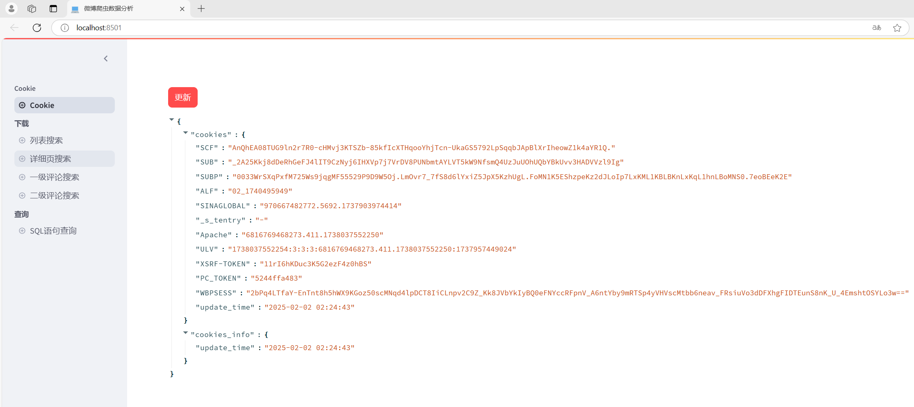
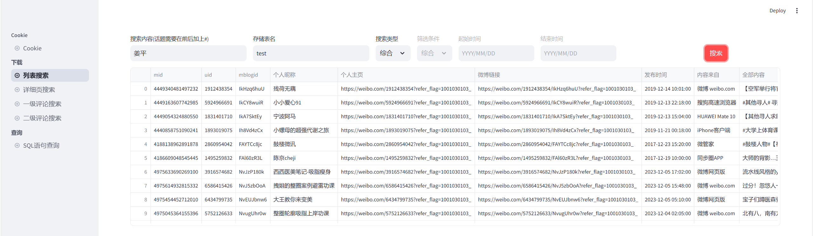
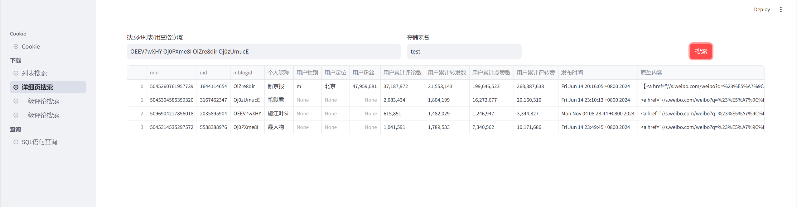
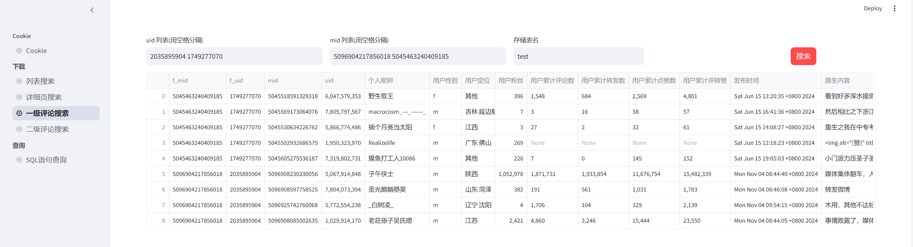
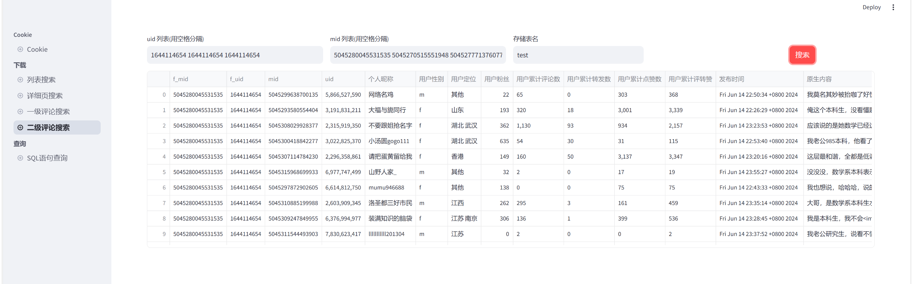
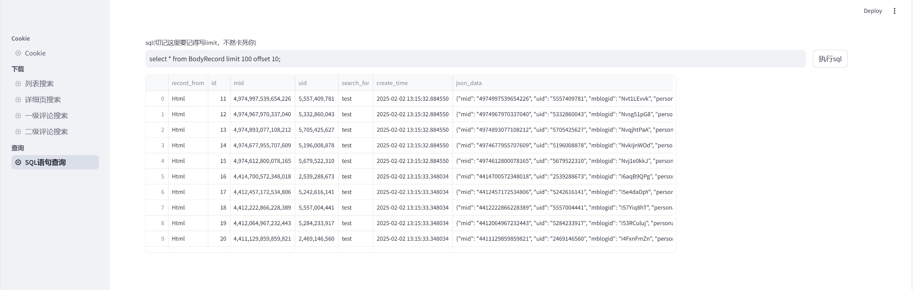
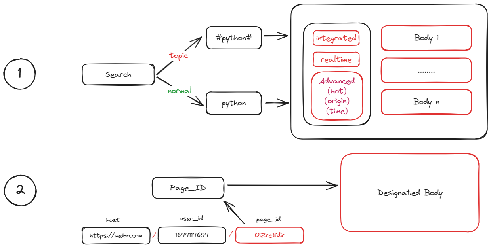
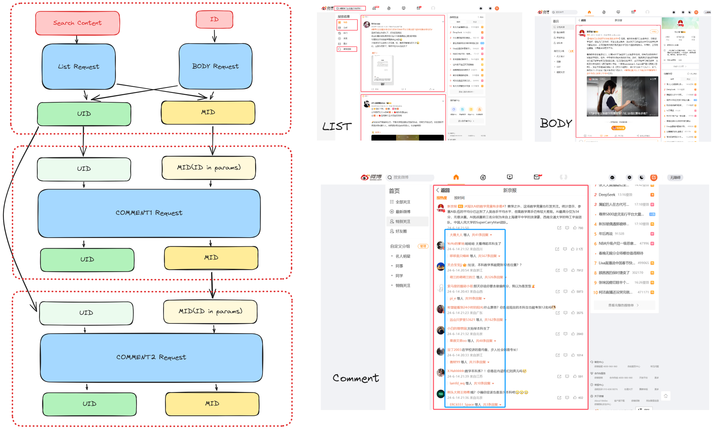
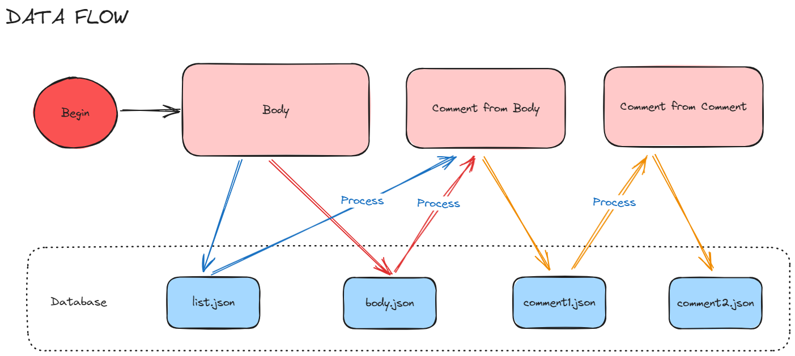

<div align=center>
</img>
<h1>WeiBoCrawler</h1>
</div>

# 欢迎！如果好用点个 star 🌟 呗！🤗 积累到 111 个赞使用 tauri 重构！！

😉😉😉 **本项目打算长期维护，欢迎大家 Pull requests 成为 Contributor** 😉😉😉

😘😘😘 **如果发现 bug, 可以通过提 [Issues](https://github.com/zhouyi207/WeiBoCrawler/issues) 或添加微信: woyaolz 沟通 ！** 😘😘😘

### 😁该项目是什么?

该项目主要用于对微博进行数据采集，包括微博详细页内容、微博评论内容、微博转发量、微博点赞量，微博评论量等信息，方便做学术研究时采集数据。

### 😋为什么使用本项目?

- **简单:** 快速上手，只需几行代码即可完成数据采集。
- **高效:** 采用异步请求和异步存储的方式，大大提高数据采集效率。
- **可视化:** 利用 streamlit 编写了一个可视化界面，方便用户进行数据采集和数据查询。
- **数据库:** 将 tinydb 改为 SQL 数据库，可以连接自定义数据库。
- **Cookies:** 不需要手动输入 cookies，扫码自动获取 cookies。

### 🥂更新修复
- 2025.04.11 解决高级检索选择日期只能选择10年范围之内的日期问题。
- 2025.03.31 解决高级检索时间问题，同时删除了检索出现微博推荐的 “可能感兴趣” 的无关数据。
- 2025.03.02 web前端获取cookie使用线程进行优化，替换掉 PIL.Image 库将二维码展示在网页中。
- 2025.02.23 添加一个错误报错提示，先获取 cookie 才能生成 config.toml 文件，否则会报错。

## 🚤快速上手

### 1. 下载本项目

在指定目录下使用 **git 命令克隆本项目** 或 **下载本项目的 zip 包然后解压**。

```bash
git clone https://github.com/zhouyi207/WeiBoCrawler.git
```

### 2. 安装依赖

在项目根目录下使用 **pip 命令安装依赖**，注意这里的 Python 版本是 3.10 版本。

```bash
pip install -r requirements.txt
```

### 3. 运行程序

在项目根目录下使用 **streamlit 命令运行程序**。

```bash
streamlit run web/main.py
```


<div align=center>
</img>
<p style="font-size:15px; font-weight:bold">成功运行🥳🥳🥳</p>
</div>

## 🎨 界面展示

### 1. 列表搜索

<div align=center>
</img>
<p style="font-size:15px; font-weight:bold">列表搜索</p>
</div>


### 2. 详细页搜索

<div align=center>
</img>
<p style="font-size:15px; font-weight:bold">详细搜索</p>
</div>

### 3. 一级评论搜索


<div align=center>
</img>
<p style="font-size:15px; font-weight:bold">一级评论搜索</p>
</div>


### 4. 二级评论搜索

<div align=center>
</img>
<p style="font-size:15px; font-weight:bold">二级评论搜索</p>
</div>

### 5. SQL 数据库查询

<div align=center>
</img>
<p style="font-size:15px; font-weight:bold">SQL 数据库查询</p>
</div>

## 🧑‍🎓项目相关

### 1. 主体处理

<div align=center>
</img>
</div>

### 2. UID 和 MID

<div align=center>
</img>
</div>

### 3. 数据流向

<div align=center>
</img>
</div>


## 📱联系

<div align=center>
</img>
</div>


## ⚠️⚠️⚠️ 注意事项

本项目仅用于学术研究，**请勿用于商业用途**。
