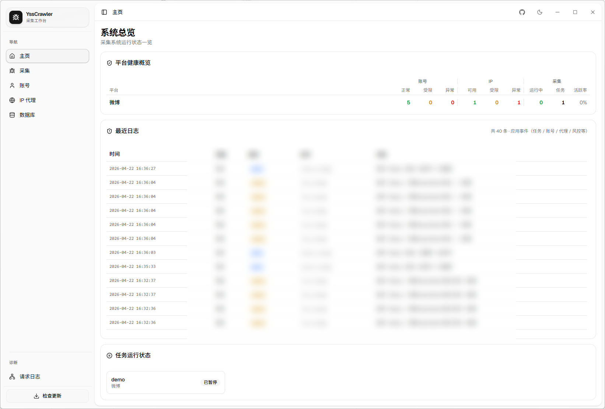
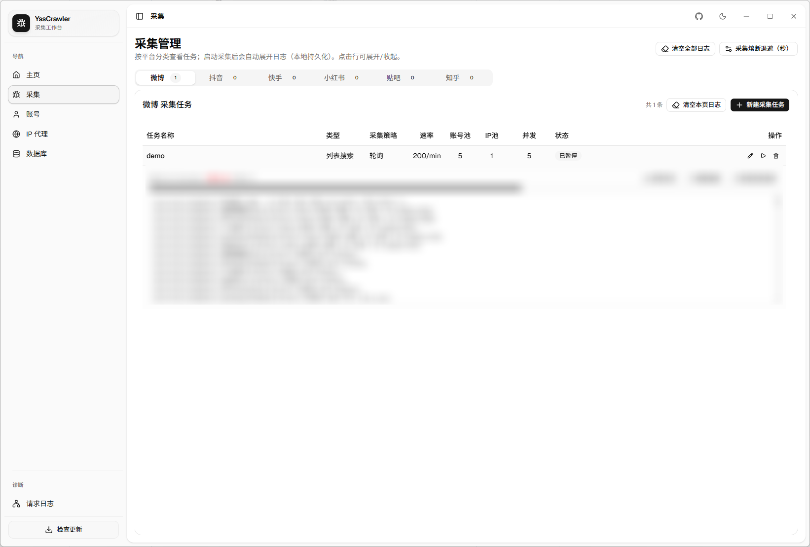
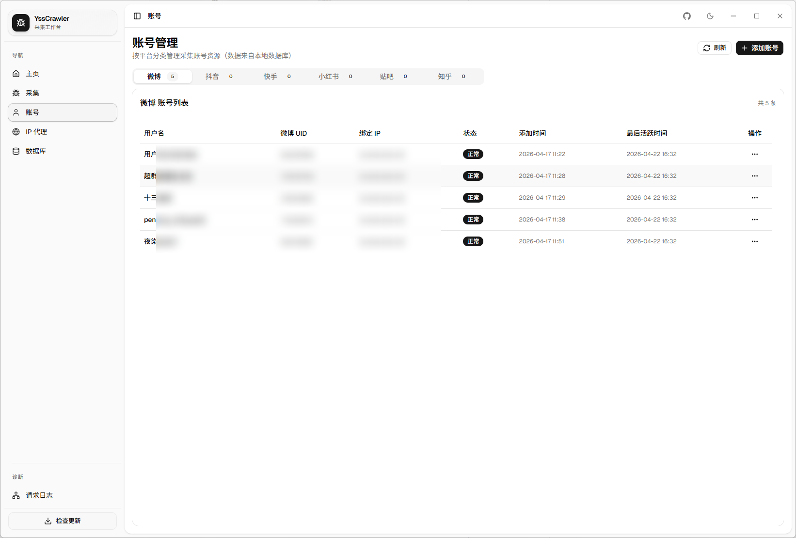
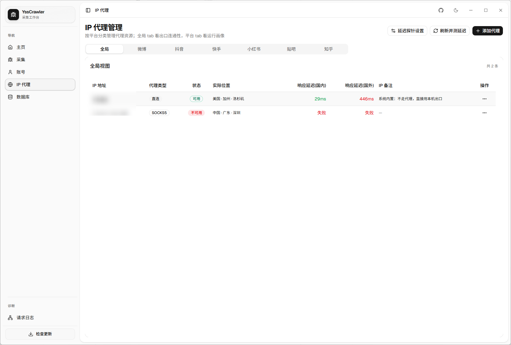
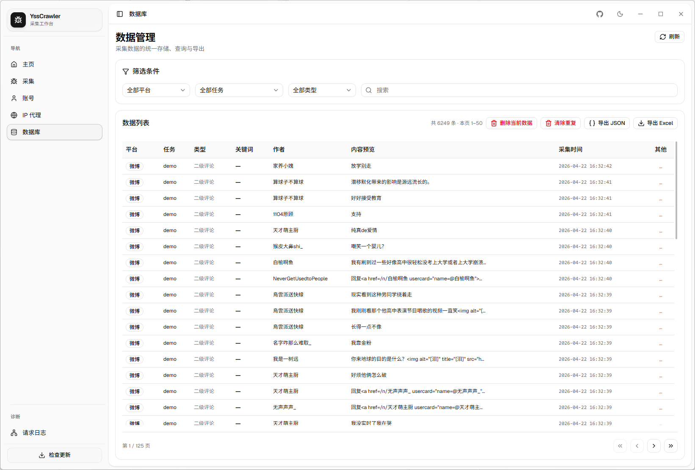

</img>
<h1>WeiBoCrawler(新重构)</h1>

</img>

欢迎！如果好用点个 star 🌟 呗！后面会更新知乎，贴吧，小红书，抖音，快手等平台

本项目打算长期维护，欢迎大家 Pull requests 成为 Contributor, 如果发现 bug, 可以通过提 [Issues](https://github.com/zhouyi207/WeiBoCrawler/issues) 或添加微信: woyaolz 沟通

### 项目介绍

该项目主要用于对微博进行数据采集，包括微博详细页内容、微博评论内容、微博转发量、微博点赞量，微博评论量等信息，方便做学术研究时采集数据。

### 项目优势

- **简单:** 快速上手，点击即可完成数据采集。
- **高效:** 采用异步请求和异步存储的方式，大大提高数据采集效率。
- **多账号多IP：** 拥有账号管理和IP管理，可以使用多账号多IP采集。
- **可视化:** 全新可视化界面，方便用户进行数据采集和数据查询。
- **Cookies:** 不需要手动输入 cookies，扫码自动获取 cookies。

### 更新修复

- 2026.04.22 弃用 streamlit 前端，全新页面，全新体验！
- 2025.04.11 解决高级检索选择日期只能选择10年范围之内的日期问题。
- 2025.03.31 解决高级检索时间问题，同时删除了检索出现微博推荐的 “可能感兴趣” 的无关数据。
- 2025.03.02 web前端获取cookie使用线程进行优化，替换掉 PIL.Image 库将二维码展示在网页中。
- 2025.02.23 添加一个错误报错提示，先获取 cookie 才能生成 config.toml 文件，否则会报错。

## 下载安装

在 [release](https://github.com/zhouyi207/WeiBoCrawler/releases/latest) 页面下载对应版本就好了，python 版本在 python 分支中

## 界面展示

### 1. 主页

</img>

主页

### 2. 采集页面

</img>

采集页面

### 3. 账号页面

</img>

账号页面

### 4. IP代理页面

</img>

IP代理页面

### 5. 数据库页面

</img>

数据库页面

## 📱联系

</img>

## 注意事项

本项目仅用于学术研究，**请勿用于商业用途**。
